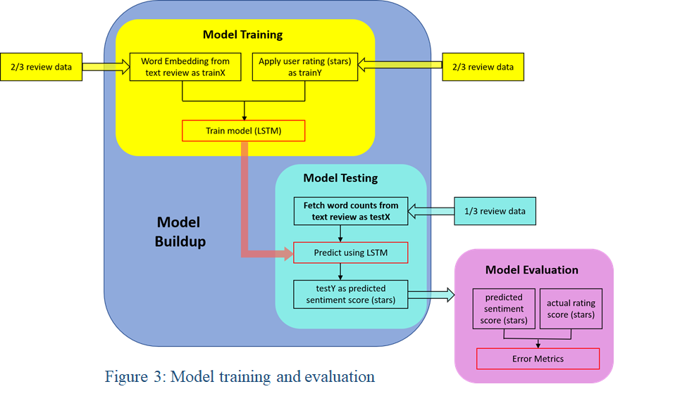

# Restaurant Investment Recommendation System

## Project Overview

In this project, we aim to provide a software as a service (SaaS) solution that helps potential restaurant owner learning the key factors of success in major U.S. cities. In the web application that we design the users be provided a report with the key factors (restaurant category, average rating of restaurants in this neighborhood etc.) of the restaurant business in a certain location, as well as an interactive graph with the restaurants with projected “popularity score”. Therefore, our project if successful could be very beneficial to startup of new restaurant business.  

## Team

- Xinyu Chen  
- Chung Yau Jefferson Choi  
- Shuyan Huang
- Ruochen Han  
- Zuodong Jiang
- Siu Hang Chan  

## Data Preparation

Firstly, the original dataset is the yelp review data from Kaggle competition. It contains 5,200,000 user reviews with corresponding rating stars; 174,000 businesses information including business name, address, latitude/longitude and business categories. The first step for the data cleaning is to parse the JSON file and load datasets to the PostgreSQL server on AWS RDS. Then, we transform the longitude-latitude data using PostGIS to store the data in a geographic coordinate system, WGS84 (SRID 4326), which enabled us to calculate the distance between points. In addition, we filtered out the businesses outside of the US and focus on restaurant business only. In the cleaned dataset, we found over 1000 restaurant
categories and over 280,000 reviews.  

Secondly, we used NLTK package in python to tokenize the reviews into words and removed punctuations. Stemming or removing stop words is optional since we did not find any improvement on the later model performance. The large corpus in the training set of word2vec might make stop words removing unnecessary. Meanwhile, stemming might hurt the context which word2vec mean. After the pre-process that we describe above, the data is ready for feature engineering and popularity score calculation.  

## Approaches

In general, we conducted novel analyses in combination with traditional business model with state-of-art big data and NLP techniques (Mikolov et al. 2013a).

1. The NLP technique that we used is word2vec (Fig 1). We trained the word2vec embedding matrix on 1 million user reviews and limited that context window to 10 words. The figure 2 shows the clustering analysis of the trained word vectors of restaurant categories.  

   

2. Model Training (Fig 3). Two thirds of review dataset are used for training, and the other one third of datasets was used for testing. We treated input word vectors as exogenous variables (X) and Yelp rating score (stars) as endogenous variable (Y). A LSTM (long short term memory) model was used for training.  

   

3. Popularity score definition. We define popularity score by combing Check-ins in Yelp dataset as a restaurant’s implicit popularity and rating star as explicit popularity (Zhang et al. 2016). The definition formula shows below:

   

4. Web page visualization (Fig 4). We use web pages as our user interface and Ruby on Rails is our main framework inside which we use HTML, CSS, JavaScript using the D3 framework. Figure 6 is the demo for the welcome page of our UI. There are three section areas: (a) user input area (b) welcome area (c) map area. 

   

   

## Experiments and Results

1. Model evaluation. In our project, we build a few prediction models for experimental purpose. In additional to the baseline model (multinomial Naïve Bayes classifier), we also applied two LSTM neural network which are based on different word embedding matrices as the input layer. The first word embedding matrix is trained on the 1 million yelp reviews using word2vec technique. The second is the pertained Glove embedding matrix based on 2 billion twitter post.

   

   After training models by different classifiers, the accuracy and the F1 score can be obtained by comparing the estimated rating score and the true rating score from the testing dataset. Figure 5 shows the class distribution in the training set. Figure 6 shows the validation accuracy of the LSTM with word2vec embedding and the Glove embedding, indicating that Word2Vec matrix were more robust and with lower variance than Glove because of lower difference between the training accuracy and the validation accuracy. We then applied the benchmark Naïve Bayes model, LSTM-Word2Vec Model, LSTM-Glove Model to the testing set. Both LSTM model outperformed the benchmarking model on average and class-wise F1 score (Table 1). 

2. Popularity score accuracy. To examine the popularity score accuracy, the prediction star based on the review using the NLP model is calculated for each zip code. Therefore, each zip code, each category has one popularity score and one prediction star. In case there is missing of either popularity score or prediction star due to lacking data, this zip code or category will be ignored. Table 2 shows the Italian restaurant comparison of the Cleveland area. The popularity score varies 1-10 and the prediction star varies 1-5. To study the correlation between popularity score and prediction star, Figure 10 plot the data of each restaurant category at the Cleveland area. Regardless of restaurant category, the popularity score is positively proportional to the prediction score. 

   

3. Final software product. Figure 8 shows 10 different locations (zip code) for American type restaurants in the city of Cleveland. Each data point represents the average popularity scores from nearby 5 similar type of restaurants within this area. Top ten positive/negative key-words are also included. 

   

## Conclusion and Discussion

Our study uses NLP technique to build a model by extracting semantic and sentiment contents from the Yelp review data, instead of depending only on customers’ review scores. This gives business people more useful insight to evaluate customers preference. We also define a novel popularity score to evaluate the restaurant’s popularity. In our equation, we do not only consider customers’ explicit feedback coming from rating and review data, but also including their implicit feedback coming from the check-in data, and thus our popularity score can better represent customer’s preferences and this restaurant’s popularity. In addition, we use K-nearest Neighbor algorithm to find similar type of restaurants within a local area. The popularity scores aggregated from these restaurants will indicates if a new restaurant is open in this local area, the possibility for it to be successful. However, due to lack of free data, only a few big cities are included in the dataset. In future practical extension of the application, it will be helpful to extend it to have a better coverage of cities with more data from Yelp.

## References

- Mark Turner, David Budgen, and Pearl Brereton. Turning software into a service. Computer., 36 (10):38–44, 2003.  
- Tomas Mikolov, Kai Chen, Greg Corrado, and Jeffrey Dean. Efficient estimation of word representations in vector space. arXiv preprint arXiv:1301.3781, 2013a.  
- Fuzheng Zhang, Nicholas Jing Yuan, Kai Zheng, Defu Lian, Xing Xie, and Yong Rui. Exploiting dining preference for restaurant recommendation. In Proceedings of the 25th International Conference on World Wide Web, pp. 725–735. International World Wide Web Conferences Steering Committee, 2016.

